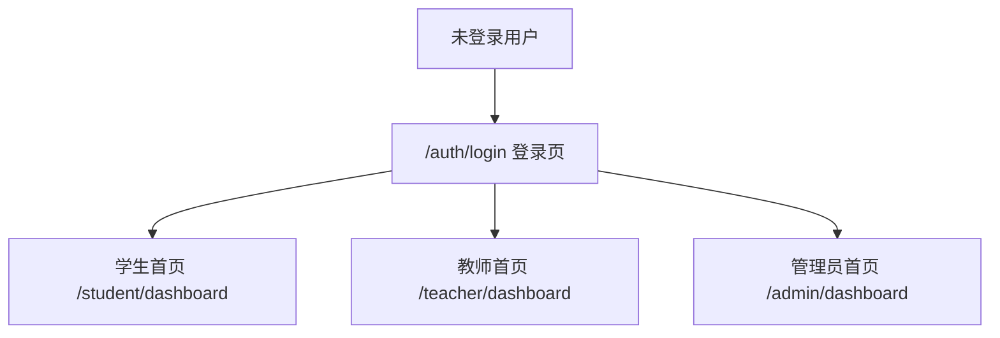
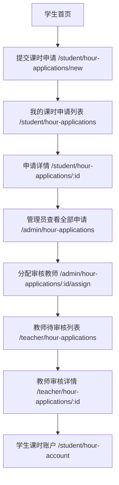
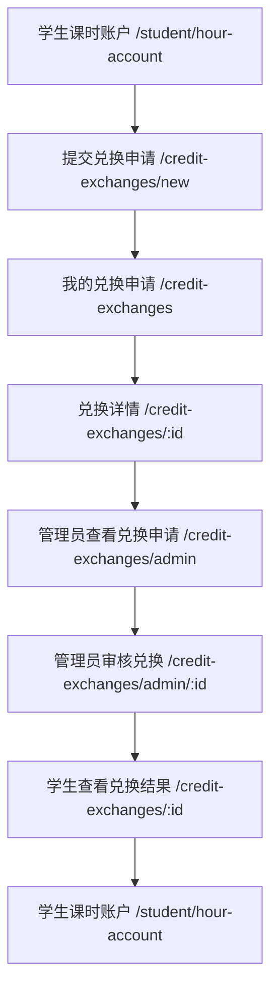

# 课时兑换学分系统超详细需求文档

## 1. 文档说明

本文档用于沉淀当前“课时兑换学分系统”第一阶段的完整需求、实现范围、接口清单、数据库结构、页面跳转流程、已实现功能，以及验收流程和标准。

本文档对应的系统定位为：

- 面向校内学生、教师、管理员的课时认定与学分兑换系统
- 当前阶段采用 `Flask + Python + MySQL`
- 当前系统目标是先实现最小可上线版本
- 当前已完成两条核心主线：
  - 课时申请主线
  - 学分兑换主线

## 2. 系统目标

系统用于解决以下业务问题：

- 学生在线提交课时申请
- 管理员查看申请并分配审核教师
- 教师在线审核课时申请
- 系统自动为学生累计可用课时
- 学生基于可用课时提交学分兑换申请
- 管理员审核兑换申请
- 系统自动扣减课时并生成兑换记录

## 3. 当前角色划分

系统当前有 3 类角色：

- 学生 `student`
- 教师 `teacher`
- 管理员 `admin`

各角色职责如下：

### 3.1 学生

- 登录系统
- 提交课时申请
- 查看自己的课时申请
- 查看申请审核结果
- 查看个人课时账户
- 提交学分兑换申请
- 查看自己的兑换申请和兑换结果

### 3.2 教师

- 登录系统
- 查看分配给自己的课时申请审核任务
- 查看申请详情和证明材料
- 审核通过
- 审核驳回
- 填写审核意见
- 修改最终认定课时数

### 3.3 管理员

- 登录系统
- 查看全部课时申请
- 分配审核教师
- 查看全部兑换申请
- 审核兑换申请

## 4. 当前业务范围

当前第一阶段只覆盖以下两条主线：

### 4.1 第一条主线：课时申请

```text
学生提交课时申请
-> 管理员查看申请
-> 管理员分配审核教师
-> 教师审核通过/驳回
-> 审核通过后学生获得课时
-> 学生查看课时账户和申请结果
```

### 4.2 第二条主线：学分兑换

```text
学生提交学分兑换申请
-> 管理员审核兑换申请
-> 审核通过后扣减学生课时
-> 生成兑换记录
-> 学生查看兑换结果
```

## 5. 学生端课时申请字段

当前课时申请页面已按最小版整体规划调整为以下字段：

1. 任务类别
2. 任务详情描述
3. 参与人员
4. 专业
5. 课程
6. 课任/指导老师
7. 证明材料
8. 兑换课程课时

### 5.1 任务类别选项

当前系统固定为 4 类：

- 项目类 `project`
- 实践类 `practice`
- 竞赛类 `competition`
- 证书类 `certificate`

## 6. 系统页面结构

### 6.1 公共页面

- 登录页 `/auth/login`
- 退出登录 `/auth/logout`
- 首页 `/`

### 6.2 学生端页面

- 学生首页 `/student/dashboard`
- 提交课时申请 `/student/hour-applications/new`
- 我的课时申请列表 `/student/hour-applications`
- 课时申请详情 `/student/hour-applications/<id>`
- 我的课时账户 `/student/hour-account`
- 提交学分兑换申请 `/credit-exchanges/new`
- 我的兑换申请列表 `/credit-exchanges`
- 兑换申请详情 `/credit-exchanges/<id>`

### 6.3 教师端页面

- 教师首页 `/teacher/dashboard`
- 分配给我的申请列表 `/teacher/hour-applications`
- 审核申请详情页 `/teacher/hour-applications/<id>`

### 6.4 管理员端页面

- 管理员首页 `/admin/dashboard`
- 全部课时申请列表 `/admin/hour-applications`
- 分配审核教师 `/admin/hour-applications/<id>/assign`
- 全部兑换申请列表 `/credit-exchanges/admin`
- 审核兑换申请详情 `/credit-exchanges/admin/<id>`

## 7. 接口文档

说明：

- 当前系统是服务端渲染系统
- 下面列出的接口均为当前已经存在并可访问的页面路由
- 如果后续改为前后端分离，可在此基础上抽象为 REST API

### 7.1 公共认证接口

#### 7.1.1 登录

- 路径：`/auth/login`
- 方法：`GET`, `POST`
- 角色：未登录用户
- 说明：
  - `GET`：打开登录页
  - `POST`：提交账号密码
- 表单参数：
  - `username`
  - `password`
  - `csrf_token`
- 返回结果：
  - 登录成功后，按角色跳转到对应首页
  - 登录失败显示错误提示

#### 7.1.2 退出登录

- 路径：`/auth/logout`
- 方法：`GET`
- 角色：已登录用户
- 说明：
  - 清空登录态
  - 返回登录页

#### 7.1.3 首页

- 路径：`/`
- 方法：`GET`
- 角色：全部用户
- 说明：
  - 显示系统首页和入口按钮

### 7.2 学生端接口

#### 7.2.1 学生首页

- 路径：`/student/dashboard`
- 方法：`GET`
- 角色：学生
- 说明：
  - 显示学生工作台入口

#### 7.2.2 提交课时申请

- 路径：`/student/hour-applications/new`
- 方法：`GET`, `POST`
- 角色：学生
- 说明：
  - `GET`：打开课时申请表单
  - `POST`：提交课时申请
- 请求字段：
  - `task_type_code`
  - `title`
  - `participant_members`
  - `major_name`
  - `course_name`
  - `instructor_name`
  - `requested_hours`
  - `attachments`
  - `csrf_token`
- 结果：
  - 成功后写入课时申请主表和附件表
  - 状态初始化为 `submitted`

#### 7.2.3 我的课时申请列表

- 路径：`/student/hour-applications`
- 方法：`GET`
- 角色：学生
- 说明：
  - 查看自己提交的课时申请列表

#### 7.2.4 课时申请详情

- 路径：`/student/hour-applications/<id>`
- 方法：`GET`
- 角色：学生
- 说明：
  - 查看单条课时申请详情
  - 查看附件信息
  - 查看审核记录

#### 7.2.5 我的课时账户

- 路径：`/student/hour-account`
- 方法：`GET`
- 角色：学生
- 说明：
  - 查看累计获得课时
  - 查看已兑换课时
  - 查看剩余可兑换课时
  - 查看已兑换学分

#### 7.2.6 提交学分兑换申请

- 路径：`/credit-exchanges/new`
- 方法：`GET`, `POST`
- 角色：学生
- 说明：
  - `GET`：打开兑换申请表单
  - `POST`：提交兑换申请
- 请求字段：
  - `requested_hours`
  - `description`
  - `csrf_token`
- 业务规则：
  - 当前申请兑换课时数不能超过学生当前可用课时
  - 按配置比例自动计算预计兑换学分

#### 7.2.7 我的兑换申请列表

- 路径：`/credit-exchanges`
- 方法：`GET`
- 角色：学生
- 说明：
  - 查看自己的兑换申请列表

#### 7.2.8 兑换申请详情

- 路径：`/credit-exchanges/<id>`
- 方法：`GET`
- 角色：学生
- 说明：
  - 查看兑换申请详情
  - 查看审核意见和状态

### 7.3 教师端接口

#### 7.3.1 教师首页

- 路径：`/teacher/dashboard`
- 方法：`GET`
- 角色：教师

#### 7.3.2 分配给我的申请列表

- 路径：`/teacher/hour-applications`
- 方法：`GET`
- 角色：教师
- 说明：
  - 查看管理员分配给当前教师的课时申请

#### 7.3.3 审核课时申请

- 路径：`/teacher/hour-applications/<id>`
- 方法：`GET`, `POST`
- 角色：教师
- 说明：
  - `GET`：查看申请详情、证明材料、历史审核记录
  - `POST`：提交审核结果
- 请求字段：
  - `action`
  - `approved_hours`
  - `comment`
  - `csrf_token`
- 业务规则：
  - `approve`：通过，更新最终认定课时，给学生入账
  - `reject`：驳回，不入账

### 7.4 管理员端接口

#### 7.4.1 管理员首页

- 路径：`/admin/dashboard`
- 方法：`GET`
- 角色：管理员

#### 7.4.2 全部课时申请列表

- 路径：`/admin/hour-applications`
- 方法：`GET`
- 角色：管理员
- 查询参数：
  - `status`
- 说明：
  - 支持按状态筛选
  - 当前筛选范围：
    - `submitted`
    - `assigned`
    - `approved`
    - `rejected`

#### 7.4.3 分配审核教师

- 路径：`/admin/hour-applications/<id>/assign`
- 方法：`GET`, `POST`
- 角色：管理员
- 说明：
  - `GET`：打开分配审核教师页面
  - `POST`：为该申请指定教师
- 请求字段：
  - `teacher_id`
  - `csrf_token`
- 结果：
  - `assigned_teacher_id` 写入申请表
  - 状态更新为 `assigned`

#### 7.4.4 全部兑换申请列表

- 路径：`/credit-exchanges/admin`
- 方法：`GET`
- 角色：管理员
- 说明：
  - 查看全部兑换申请

#### 7.4.5 审核兑换申请

- 路径：`/credit-exchanges/admin/<id>`
- 方法：`GET`, `POST`
- 角色：管理员
- 说明：
  - `GET`：查看兑换申请详情
  - `POST`：提交审核结果
- 请求字段：
  - `action`
  - `review_comment`
  - `csrf_token`
- 业务规则：
  - `approve`：通过，扣减课时并生成兑换记录
  - `reject`：驳回，不扣减课时

## 8. 数据库设计

当前系统主要使用以下数据表。

## 8.1 users

统一账号表，用于登录、角色识别和登录态管理。

字段如下：

- `id`：主键
- `username`：登录账号
- `password_hash`：密码哈希
- `role`：角色
- `real_name`：真实姓名
- `phone`：手机号
- `email`：邮箱
- `status`：账号状态
- `last_login_at`：最后登录时间
- `created_at`：创建时间
- `updated_at`：更新时间

## 8.2 students

学生信息表。

字段如下：

- `id`
- `user_id`
- `student_no`
- `name`
- `gender`
- `college`
- `major`
- `grade`
- `class_name`
- `status`
- `created_at`
- `updated_at`

## 8.3 teachers

教师信息表。

字段如下：

- `id`
- `user_id`
- `teacher_no`
- `name`
- `department`
- `title`
- `status`
- `created_at`
- `updated_at`

## 8.4 task_types

任务类型字典表。

字段如下：

- `id`
- `type_code`
- `type_name`
- `status`
- `sort_order`
- `created_at`
- `updated_at`

## 8.5 hour_applications

课时申请主表。

字段如下：

- `id`
- `application_no`：申请单号
- `student_id`：学生 ID
- `title`：任务详情描述
- `participant_members`：参与人员
- `major_name`：专业
- `course_name`：课程
- `instructor_name`：课任/指导老师
- `achievement_submission`：历史遗留字段，当前页面未再使用
- `task_type_code`：任务类别编码
- `requested_hours`：申请课时数，也即兑换课程课时
- `description`：历史遗留字段，当前页面未再使用
- `status`：状态
- `assigned_teacher_id`：分配审核教师
- `final_hours`：最终认定课时数
- `reviewed_at`：审核完成时间
- `created_at`
- `updated_at`

### 8.5.1 状态说明

- `submitted`：学生已提交，待管理员分配
- `assigned`：已分配教师，待教师审核
- `approved`：审核通过
- `rejected`：审核驳回

## 8.6 hour_application_attachments

课时申请附件表。

字段如下：

- `id`
- `application_id`
- `file_name`
- `file_path`
- `file_size`
- `file_type`
- `uploaded_by`
- `created_at`

## 8.7 hour_application_reviews

课时申请审核记录表。

字段如下：

- `id`
- `application_id`
- `reviewer_teacher_id`
- `action`
- `comment`
- `approved_hours`
- `created_at`

### 8.7.1 action 含义

- `approve`
- `reject`

## 8.8 student_hour_accounts

学生课时账户汇总表。

字段如下：

- `id`
- `student_id`
- `total_earned_hours`
- `total_exchanged_hours`
- `available_hours`
- `updated_at`

## 8.9 student_hour_transactions

学生课时流水表。

字段如下：

- `id`
- `student_id`
- `biz_type`
- `biz_id`
- `change_type`
- `hours_change`
- `before_hours`
- `after_hours`
- `remark`
- `created_by`
- `created_at`

### 8.9.1 biz_type 取值

- `hour_application`
- `credit_exchange`
- `manual_adjust`

### 8.9.2 change_type 取值

- `increase`
- `decrease`

## 8.10 credit_exchange_applications

学分兑换申请主表。

字段如下：

- `id`
- `exchange_no`
- `student_id`
- `requested_hours`
- `estimated_credits`
- `description`
- `status`
- `reviewed_by_admin_id`
- `review_comment`
- `approved_at`
- `created_at`
- `updated_at`

### 8.10.1 状态说明

- `submitted`：已提交，待管理员审核
- `approved`：兑换审核通过
- `rejected`：兑换审核驳回

## 8.11 credit_exchange_records

兑换成功记录表。

字段如下：

- `id`
- `exchange_application_id`
- `student_id`
- `used_hours`
- `exchanged_credits`
- `rule_snapshot`
- `created_at`

## 8.12 system_configs

系统配置表。

字段如下：

- `id`
- `config_key`
- `config_value`
- `description`
- `updated_at`

### 8.12.1 当前已使用配置

- `credit_exchange_ratio`
- `max_single_exchange_hours`
- `allow_student_resubmit`

## 8.13 operation_logs

操作日志表。

字段如下：

- `id`
- `user_id`
- `module`
- `biz_type`
- `biz_id`
- `action`
- `detail`
- `ip`
- `created_at`

说明：

- 当前系统已建表
- 当前第一阶段还未在主要业务流中全面落操作日志

## 9. 数据关系说明

系统当前的主要关系如下：

- `users` 与 `students`：一对一
- `users` 与 `teachers`：一对一
- `students` 与 `hour_applications`：一对多
- `hour_applications` 与 `hour_application_attachments`：一对多
- `hour_applications` 与 `hour_application_reviews`：一对多
- `teachers` 与 `hour_applications`：一对多
- `students` 与 `student_hour_accounts`：一对一
- `students` 与 `student_hour_transactions`：一对多
- `students` 与 `credit_exchange_applications`：一对多
- `credit_exchange_applications` 与 `credit_exchange_records`：一对一

## 10. 当前页面跳转流程示意图

### 10.1 全局入口流程



### 10.2 第一条主线：课时申请流程



### 10.3 第二条主线：学分兑换流程



### 10.4 当前页面流转说明

学生端：

- 登录后进入学生首页
- 可以提交课时申请
- 可以查看我的课时申请
- 可以查看课时账户
- 可以发起学分兑换申请
- 可以查看我的兑换申请

教师端：

- 登录后进入教师首页
- 进入分配给我的申请列表
- 点击“进入审核”
- 查看详情并提交审核

管理员端：

- 登录后进入管理员首页
- 进入全部课时申请列表
- 分配审核教师
- 进入全部兑换申请列表
- 审核兑换申请

## 11. 当前已实现功能清单

## 11.1 登录与权限

已实现：

- 账号密码登录
- 登录后按角色跳转
- 角色权限控制
- 未登录禁止访问业务页面

## 11.2 课时申请主线

已实现：

- 学生提交课时申请
- 任务类别选择
- 填写任务详情描述
- 填写参与人员
- 填写专业
- 填写课程
- 填写课任/指导老师
- 上传证明材料
- 填写兑换课程课时
- 学生查看申请列表
- 学生查看申请详情
- 管理员查看全部课时申请
- 管理员按状态筛选申请
- 管理员分配审核教师
- 教师查看分配给自己的申请
- 教师查看申请详情
- 教师查看证明材料
- 教师审核通过
- 教师审核驳回
- 教师填写审核意见
- 教师修改最终认定课时数
- 审核通过后给学生课时账户入账
- 学生查看课时账户

## 11.3 学分兑换主线

已实现：

- 学生发起学分兑换申请
- 系统显示当前可用课时
- 系统根据兑换比例计算预计兑换学分
- 系统校验课时是否足够
- 学生查看兑换申请列表
- 学生查看兑换申请详情
- 管理员查看全部兑换申请
- 管理员审核兑换申请
- 管理员审核通过后扣减学生可用课时
- 生成兑换成功记录
- 写入课时流水
- 学生课时账户显示已兑换课时
- 学生课时账户显示已兑换学分

## 11.4 配置与基础数据

已实现：

- 任务类型字典表
- 系统配置表
- 账户汇总表
- 账户流水表
- 审核记录表
- 兑换记录表
- 初始化测试账号
- 初始化基础任务类型
- 初始化兑换比例配置

## 12. 当前未实现但已明确属于后续扩展项

当前第一阶段未实现如下内容：

- 企业微信登录
- 企业微信消息通知
- 统一身份认证对接
- 管理员按专业/班级/课程/自定义条件分配审核教师
- 学生/教师基础信息完整管理页
- 管理员查看学生课时汇总后台
- 多级审核
- 驳回后重新提交
- 统计报表
- 导入导出
- 附件预览
- 审批消息提醒
- 完整操作日志落库

## 13. 企业微信接入改造建议

如果后续系统接入企业微信，建议按以下方式改造。

### 13.1 登录改造

需新增：

- 企业微信 OAuth 登录入口
- 企业微信回调接口
- 企业微信用户与本地用户绑定逻辑

建议新增字段：

- `users.wechat_user_id`
- `users.wechat_union_id`
- `users.auth_source`

### 13.2 消息通知改造

建议在以下节点发企业微信通知：

- 学生提交课时申请后通知管理员
- 管理员分配审核教师后通知教师
- 教师审核完成后通知学生
- 学生提交兑换申请后通知管理员
- 管理员审核兑换后通知学生

建议新增服务：

- `wecom_service.py`

### 13.3 配置改造

建议增加如下配置：

- `wecom_corp_id`
- `wecom_agent_id`
- `wecom_secret`
- `wecom_redirect_uri`

### 13.4 数据同步改造

如企业微信用户体系与学校教务系统打通，建议支持：

- 按手机号绑定
- 按工号绑定
- 按学号绑定

### 13.5 接入顺序建议

建议按如下顺序接：

1. 保留现有本地登录不动
2. 先增加企业微信消息通知
3. 再增加企业微信登录
4. 最后考虑组织架构同步

## 14. 当前项目测试账号

默认测试账号如下：

- 管理员：`admin / admin123`
- 教师：`teacher1 / teacher123`
- 学生：`student1 / student123`

## 15. 当前系统默认业务规则

### 15.1 课时申请

- 学生提交课时申请后状态为 `submitted`
- 管理员分配教师后状态变为 `assigned`
- 教师审核通过后状态变为 `approved`
- 教师审核驳回后状态变为 `rejected`

### 15.2 学分兑换

- 默认兑换比例为 `10:1`
- 即 `10` 课时兑换 `1` 学分
- 兑换申请提交时会先计算预计兑换学分
- 审核通过后才真正扣减课时

## 16. 验收流程和标准

本节用于作为当前第一阶段最小版系统的验收依据。

## 16.1 验收目标

确认系统已完整跑通以下两条核心主线：

- 课时申请主线
- 学分兑换主线

## 16.2 验收流程

### 16.2.1 第一条主线验收：课时申请

#### 步骤 1：学生提交申请

操作：

- 学生登录
- 进入提交课时申请页面
- 填写完整字段
- 上传证明材料
- 提交申请

验收标准：

- 提交成功
- 列表中能看到新申请
- 状态为 `submitted`

#### 步骤 2：管理员查看并分配教师

操作：

- 管理员登录
- 进入全部课时申请列表
- 找到该申请
- 点击分配教师
- 选择教师并提交

验收标准：

- 分配成功
- 申请状态变为 `assigned`
- 列表中显示已分配教师

#### 步骤 3：教师审核

操作：

- 教师登录
- 进入待审核申请列表
- 点击进入审核
- 选择通过或驳回
- 填写审核意见
- 如通过则填写最终认定课时

验收标准：

- 审核提交成功
- 若通过，状态为 `approved`
- 若驳回，状态为 `rejected`
- 审核记录可见

#### 步骤 4：学生查看结果

操作：

- 学生重新登录
- 查看申请详情
- 查看课时账户

验收标准：

- 若审核通过：
  - 申请详情显示最终认定课时
  - 课时账户增加对应课时
- 若审核驳回：
  - 显示驳回状态和审核意见
  - 课时账户不增加

### 16.2.2 第二条主线验收：学分兑换

#### 步骤 1：学生发起兑换申请

前提：

- 学生账户中已有可用课时

操作：

- 学生登录
- 进入学分兑换申请页面
- 填写申请兑换课时数
- 填写兑换说明
- 提交申请

验收标准：

- 提交成功
- 兑换申请列表中出现新记录
- 状态为 `submitted`
- 预计兑换学分计算正确

#### 步骤 2：管理员审核兑换申请

操作：

- 管理员登录
- 进入全部兑换申请列表
- 找到该申请
- 点击审核
- 选择通过或驳回
- 填写审核意见

验收标准：

- 审核提交成功
- 若通过，状态为 `approved`
- 若驳回，状态为 `rejected`

#### 步骤 3：学生查看兑换结果

操作：

- 学生登录
- 查看兑换申请详情
- 查看课时账户

验收标准：

- 若审核通过：
  - 兑换详情显示通过
  - 已兑换课时增加
  - 剩余课时减少
  - 已兑换学分增加
- 若审核驳回：
  - 兑换详情显示驳回
  - 课时账户不变化

## 16.3 验收标准总表

### 16.3.1 功能验收标准

- 学生能正常登录
- 教师能正常登录
- 管理员能正常登录
- 学生能提交课时申请
- 管理员能分配审核教师
- 教师能审核申请
- 审核通过后学生课时能自动增加
- 学生能提交兑换申请
- 管理员能审核兑换申请
- 审核通过后学生课时能自动扣减
- 学生账户能正确显示已兑换学分

### 16.3.2 数据验收标准

- 课时申请写入 `hour_applications`
- 申请附件写入 `hour_application_attachments`
- 审核记录写入 `hour_application_reviews`
- 课时账户汇总写入 `student_hour_accounts`
- 课时流水写入 `student_hour_transactions`
- 兑换申请写入 `credit_exchange_applications`
- 兑换成功写入 `credit_exchange_records`

### 16.3.3 页面验收标准

- 页面可正常打开
- 角色权限控制正确
- 页面跳转链路正常
- 列表、详情、表单页面均可访问
- 审核与提交操作后页面反馈正常

### 16.3.4 失败场景验收标准

- 登录失败时有错误提示
- 学生课时不足时不能提交兑换申请
- 教师不能审核未分配给自己的申请
- 管理员打开不存在的申请时有提示
- 学生打开不属于自己的申请时不能查看

## 17. 文档结论

截至当前，系统已经完成第一阶段最小可上线版本的核心闭环：

- 课时申请闭环已实现
- 学分兑换闭环已实现
- 接口、页面、数据库结构已基本齐备
- 后续可在此基础上继续扩展企业微信接入、筛选分配、报表统计、消息通知等能力

本文件可作为：

- 当前阶段需求说明
- 系统实现说明
- 测试验收依据
- 后续迭代的基线文档
